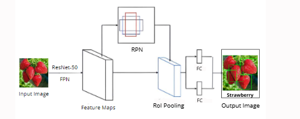

#  **FruitVision: AI-Powered Fruit Counting & Classification with Docker Containerization and Terraform Deployment** 

## **Table of Contents**
- [📌 Project Overview](#-project-overview)
- [🔑 Key Objectives](#-key-objectives)
- [🚀 Technologies Used](#-technologies-used)
- [🏛️ Architecture](#-architecture)
- [📜 Data](#-data)
- [🧠 Model](#-model)
   - [🗂️ Data Annotation: Transformation to COCO Format](#️-data-annotation-transformation-to-coco-format)
   - [🧠 Model Architecture](#-model-architecture)
- [🔗 Model Integration](#-model-integration) 
- [🛠️ Node.js Express Backend](#️-nodejs-express-backend)
- [📱 Flutter Application](#️-flutter_application)
- [🐳 Dockerization](#-dockerization)  
- [☁️ Deployment Using Terraform](#-deployment-using-terraform)
- [📱 Results: Application interfaces](#-results-application-interfaces)
- [🔧 Setup and usage](#-setup-and-usage)
- [🔮 Future Considerations](#-future-considerations)
- [👨‍💻 Project By](#-project-by)

---

## 📌 Project Overview  

### 📚 Background:
This project, developed by Hiba Daoud and Farah Elloumi as part of their end-of-year work at the Higher School of Communications in Tunis (SUP'COM), aims to **count and classify fruits on trees** to assist farmers in **yield estimation** while maintaining a **detailed history** of the classified fruits for improved tracking and management.

### 🌟 Project Scope:

The project is divided into **three main parts**:
1. **Model Development**: Building a deep learning computer vision model for processing, detecting, classifying, and counting fruits on trees.
2. **Application Development**: Integrating the model into an application, with a backend and a persistent database for seamless functionality.
3. **Deployment and Scalability**: Packaging the application into containers, orchestrating services for seamless operation, and automating infrastructure deployment to ensure scalability, consistency, and efficient resource management.


## 🔑 Key Objectives

- 🖼️ **User-Friendly Interface**  
   Develop an **intuitive and easy-to-use application** that allows farmers to:
   - Capture photos of their trees.  
   - View the processed results, including fruit detection, classification, and counts.  
   - View the history of the predicted trees photos.

- 🧠 **Deep Learning Integration**  
   Incorporate a **computer vision model** for:  
   - Image processing.  
   - Accurate detection, classification, and counting of fruits on trees.  

- 📊 **Data Persistence**  
   Implement a **MongoDB database** to:  
   - Store the history of fruit yield estimations.  
   - Enable efficient tracking and analysis for crop management.  

- 🔗 **Seamless Integration**  
   Ensure smooth and real-time integration between the following components:  
   - **Deep Learning Model**  
   - **Application Frontend** (for user interaction).  
   - **Backend Database** (for data storage and retrieval).  

- 🐳 **Containerization and Orchestration**  
   Package the application components (backend, model, and database) into lightweight **containers** to ensure portability. Use **Docker compose** an orchestration tool to manage and run these services together seamlessly.

- ☁️ **Infrastructure Automation**  
   Automate the provisioning and deployment of the system infrastructure to the cloud, ensuring consistency, scalability, and simplified resource management.


## 🚀 Technologies Used

| Component            | Technology                          |
|-----------------------|-------------------------------------|
| **Model**            | Detectron2, Faster R-CNN |
| **Backend API**      | FastAPI                             |
| **Frontend**         | Flutter                             |
| **Backend**          | Express.js, MongoDB                |
| **Authentication**   | Firebase Auth                      |
| **Container Management** | Docker & Docker Compose                             |
| **Infrastructure**   | Terraform                           |

## 🏛️ Architecture
<div align="center">
    
</div>

The FruitVision application is built on a modular architecture, with components logically organized to ensure efficient operations and scalability. Below is an explanation of each layer:

### 1. **Frontend (Flutter Application)**:
   - **Purpose**: Serves as the primary interface for user interaction. 
   - **Functionality**:
     - Allows users to upload images of fruit trees.
     - Displays results, including fruit counts and classifications.
     - Facilitates history tracking of previously analyzed images.

### 2. **Backend Services**:
   - **FastAPI (AI Service)**:
     - Manages communication with the deep learning model (Detectron2).
     - Processes images to detect, classify, and count fruits.
   - **Express.js (History Service)**:
     - Handles operations related to maintaining and updating the history in MongoDB.
     - Acts as an intermediary between the frontend and database for history-related queries.

### 3. **Database (MongoDB)**:
   - Stores the history of fruit classifications and user interactions.
   - Ensures persistent data storage for analysis and future retrieval.

### 4. **Docker Compose**:
   - **Encapsulation**: Orchestrates the backend services (FastAPI and Express.js) and MongoDB to ensure they run seamlessly in isolated containers.
   - Simplifies deployment by bundling all services into a single configuration.

### 5. **Infrastructure (Azure Virtual Machine)**:
   - Provisioned using **Terraform** to host the Docker Compose setup in a cloud environment.
   - Provides scalability and ensures high availability for the application.

### Data Flow:
1. **User uploads/takes an image** via the Flutter app.
2. The image is sent to **FastAPI** for processing using the Detectron2 model.
3. Results are returned to the **Flutter app** and simultaneously stored in **MongoDB** via the Express.js backend for history tracking.

## 📜 Data
- We collected **194 images** spanning 6 fruit categories: **Apples, Strawberries, Kiwis, Lemons, Oranges**, and an **Unknown** type.

- Each image was annotated using **LabelMe** to generate individual JSON files.  
   - These annotations include:
     - Bounding boxes.
     - Object categories.

- The images are in `./dataset/`.  

## 🧠 Model
The fruit detection model is built using **Faster R-CNN** with the [**Detectron2**](https://github.com/facebookresearch/detectron2) library.

### 🗂️ **Data Annotation: Transformation to COCO Format**

To facilitate the integration of annotated data with the model, we converted individual **LabelMe JSON files** into a single **COCO JSON file** useful for object detection and segmentation tasks.

#### **Process**   

1. **Transformation**:  
   - The **labelme2coco** tool was used to combine all LabelMe JSON files  into a single **COCO JSON file**. 
   ```bash
   pip install -U labelme2coco
   labelme2coco path/to/labelme/dir  #for individual json files
   ```
   
2. **COCO JSON Structure**:  
   The resulting COCO file contains:  
   - **Images**: The paths and metadata of all annotated images.  
   - **Annotations**: Bounding boxes, segmentation masks, and associated categories.  
   - **Categories**: Labels for the detected objects (e.g., Apples, Strawberries, etc.).

### 🧠 **Model Architecture**

We implemented the **Faster R-CNN** model with a **ResNet-50** backbone and **Feature Pyramid Network (FPN)** for fruit detection and classification.

#### **1. Feature Extraction and Multi-Scale Representation**
<div align="center">
    
</div>

- **Backbone - ResNet-50**  
   - Extracts essential features from the input images using convolutional layers.  
   - At each layer, the image resolution is divided by 2, allowing for a detailed analysis at multiple scales.  

-  **Feature Pyramid Network (FPN)**  
   - Enhances the feature maps generated by ResNet-50 by combining features at different resolutions.  
   - Produces **multi-scale feature maps** that allow the model to detect fruits of various sizes effectively.  

#### **2. Fruit Detection and Classification Process**
<div align="center">
    
</div>

1. **Region Proposal Network (RPN)**:  
   - The FPN-generated feature maps are used to propose potential regions (RoIs) where fruits might be located.  
   - Each proposal is assigned an **objectiveness score** to filter irrelevant regions.  

2. **RoI Pooling**:  
   - Valid regions are normalized and resized to a fixed size.  
   - This ensures consistent input for further processing.

3. **Classification and Refinement**:  
   - Fully connected layers analyze each **RoI** to:  
     - Determine the **class** of the detected object (e.g., Apple, Strawberry).  
     - Refine the **bounding box** around the fruit for precise localization.

4. **Final Output**:  
   - The model outputs an image annotated with **bounding boxes** around each detected fruit and its corresponding classification label.  
   - The total number of fruits is determined by counting the bounding boxes.

### 📈 **Training and Output**

1. **Training Environment**:  
   - The model was trained on **Google Colab** using the notebook file:  
     - `./P2M.ipynb` (originally derived from Detectron2's 'Getting Started' notebook)

2. **Dataset**:  
   - The training dataset provided in this repository (`./dataset`) was:
     - Converted to **COCO JSON format**.  
     - Processed using custom Python scripts to adjust minor details. (`./dataset/code`)

3. **Validation**:  
   - The validation dataset (`./dataset/val`) underwent the same processing pipeline as the training data.

4. **Output**:  
   - The final output is a **trained weight model file** stored at:  
     - `./detectron2/model_path`.  

   - This model is used for inference to detect, classify, and count fruits accurately.

## 🔗 **Model Integration**  
The trained model is integrated into the application via **FastAPI**, enabling real-time fruit detection and classification.

### **Model Path**  
- The **trained model weights** are stored in:  
   - `./detectron2/model_path/model_final.pth`.  
- The weights are loaded during **FastAPI server startup** to enable quick inference.  

### **Model Inference**  
1. **Testing and Visualization**:  
   - After training on **Google Colab**, the model was locally tested using a **Python script** (`./detectron2/P2M.py`).  
   - The visualization functions were adapted to validate predictions on test images and ensure proper detection and classification.

2. **Integration with FastAPI**:  
   - The same functions and model are used in the **FastAPI server** (`./detetron2/fastapi_code.py`) to provide an API interface for the trained model.  
   - This enables real-time predictions and seamless backend integration.

### **Endpoints**  
- **`/analyze`**: Accepts input images and processes them using the trained model to detect and classify fruits.  
- **`/get_analyzed_image/{filename}`**: Retrieves processed images with **bounding boxes** drawn around the detected fruits.

### **Data Flow**  
1. **Frontend (Flutter)**:  
   - The user uploads an image via the mobile application.  
   - The image is sent to the FastAPI backend.

2. **Backend (FastAPI)**:  
   - The FastAPI server loads the trained model.  
   - The image is processed, and the results (e.g., bounding boxes, classifications) are returned to the frontend.

3. **History Storage (MongoDB)**:  
   - The results are stored in **MongoDB** for tracking and management.

## 🛠️ **Node.js Express Backend**

The **backend** is developed using **Node.js** with the **Express.js framework**. It connects to a **MongoDB**database using **Mongoose** to handle fruit history data and provides the following endpoints:

### **API Endpoints**

1. **`GET/POST /nodejs/api/history`**  
   - Retrieve all histories or create a new history.  

2. **`GET /nodejs/api/history/os`**  
   - Fetch the **OS hostname** where the service is running.  

3. **`GET /nodejs/api/history/live`**  
   - Check if the server is live.

### **Running the Backend Alone**

To run the backend independently:

1. Navigate to the `backend` directory:
   ```bash
   cd backend
   ```

2. Create a **.env** file and define the following variables:
  ```.env
   MONGO_BASE_URI=<your_mongodb_url>
   DB_NAME=fruitvision
   MONGO_USERNAME=<your_mongodb_username>
   MONGO_PASSWORD=<your_mongodb_password>
   ```
3. Start the server:
  ```bash
   node server.js
   ```
4. Access the API:

  - http://localhost:5000/nodejs/api/history (Main endpoint).

> [!NOTE]
> Note that this step only applies if you would like to run the backend independently and use your own mongodatabase. We define one in the docker compose file

## 📱 Flutter Application

The **FruitVision mobile application** was developed using **Flutter** with **Dart** in Android Studio. It integrates **Firebase** for user authentication and connects seamlessly with the model and backend APIs to process images for fruit detection, classification, and tracking history. The app allows users to capture images via the camera or upload from the gallery, interact with the AI model, and view results.

#### Key Features:
- Firebase-based login and authentication.
- Integration with **MODEL_API** for image analysis and **HISTORY_API** for saving results.
- Camera functionality for capturing images and gallery support for uploads.

#### Example Code:
- `main.dart` : Initializes Firebase and loads environment variables
   ```dart
   void main() async {
   WidgetsFlutterBinding.ensureInitialized();
   await Firebase.initializeApp(
      options: DefaultFirebaseOptions.currentPlatform,
   );
   await dotenv.load();
   runApp(const MyApp());
   }
   ```
- `camera.dart`: Implements the camera functionality to capture and upload images
   ```dart
   Future<void> _takePicture(BuildContext context) async {
      if (_camcontroller == null || !_camcontroller!.value.isInitialized) return;

      try {
         final XFile picture = await _camcontroller!.takePicture();
         File imageFile = File(picture.path);
         await _sendImageToServer(imageFile);
      } catch (e) {
         print('Exception: $e');
      }
   }
   ```
- Sending images to the model API for analysis in  `camera.dart`
   ```dart
   Future<void> _sendImageToServer(File imageFile) async {
      final uri = Uri.parse(MODEL_API! + '/analyze/');
      final request = http.MultipartRequest('POST', uri)
         ..files.add(await http.MultipartFile.fromPath('file', imageFile.path));
      final streamedResponse = await request.send();
      final response = await http.Response.fromStream(streamedResponse);

      if (response.statusCode == 200) {
         final responseData = json.decode(response.body);
         // Process the response and navigate to results page
      } else {
         print('Error: ${response.statusCode}');
      }
   }
   ```
- Sending data to the backend API for storage in MongoDB
   ```dart
   Future<void> sendDataToBackend(String type, String resultText, String fullUrl) async {
      try {
         final uri = Uri.parse(HISTORY_API! + '/api/history'); // Backend API endpoint
         final headers = {"Content-Type": "application/json"};
         final body = jsonEncode({
            "type": type,            // Type of fruit or object detected
            "resultText": resultText, // Count
            "full_url": fullUrl,     // URL of the processed image
         });

         // Send POST request to the backend
         final response = await http.post(uri, headers: headers, body: body);

         if (response.statusCode == 200 || response.statusCode == 201) {
            print('Data successfully sent to MongoDB');
         } else {
            print('Failed to send data: ${response.statusCode}');
         }
      } catch (e) {
         print('Error sending data to backend: $e');
      }
   }
   ```

## 🐳 Dockerization

The project is fully containerized with **Docker** to ensure portability and scalability. Two Docker images are built and pushed to Docker Hub:

- **`hiba25/backend_updated`**: For the Node.js backend.  
- **`hiba25/modele`**: For the FastAPI model.

### **Docker Compose Configuration**

A `docker-compose.yml` file is provided to orchestrate the services. It includes:

1. **MongoDB**:  
   - Database service for storing history data.  
   - **Ports**: `27018:27017`  
   - **Data Persistence**: Managed using volumes.

2. **Mongo Express**:  
   - Web-based UI for MongoDB.  
   - **Accessible at**: `http://localhost:8081`

3. **Backend Service**:  
   - Node.js Express API for handling history endpoints.  
   - **Ports**: `5000:5000`

4. **Model Service**:  
   - FastAPI service hosting the deep learning model.  
   - **Ports**: `8000:8000`  
   - **Swagger UI**: Accessible at `http://your_IP:8000/docs`


## ☁️ Deployment Using Terraform

### **Goal**
The goal of using **Terraform** is to automate and provision the infrastructure required for deploying the **FruitVision application**. Terraform ensures consistency, scalability, and seamless management of cloud resources.

Using **Terraform**, we successfully automated the deployment of a Virtual Machine and networking configurations. This ensured a scalable and secure infrastructure for our application, ready for deployment of services like the Node.js backend, Mongo database and FastAPI model.


1. **Infrastructure Definition**:  
   - We defined and automated the infrastructure using Terraform files (`main.tf`, `network.tf`, `vm-provisioner.tf`).
   - Resources include:
     - **Virtual Machines (VMs)** for running services.
     - **Networking** configurations (VNet, Subnet, Security Groups) to manage communication.
     - Public IP setup for external access.

2. **Docker Compose Integration**:  
   - The **public IP** of the deployed VM is dynamically updated in the **Docker Compose file** to configure the `BASE_URL` for running the FastAPI model.

3. **SSH Key Configuration**:  
   - We set up **SSH key-pairs** to enable secure access to the provisioned virtual machines.

4. **State and Outputs**:  
   - Terraform outputs the necessary details like the **Public IP** of the deployed instances for quick access.

## 📱Results: FruitVision Application Interfaces
<br/>
<div align="center">
    <div>  
        
    </div>
    <br/>
    <div>
        
    </div>
    <br/>
    <div>
        
    </div>
    <br/>
    <div>
        
    </div>
</div>

## 🔧 Setup and usage

### Prerequisites
- Docker
- Flutter development environment (e.g., Android Studio)
- Terraform
- Azure account to build and manage the virtual machine via terraform

### Steps to Run
1. **Clone the repository**:
   ```bash
   git clone https://github.com/hibadaoud/FruitVision-AI-Powered-Fruit-Counting-Classification-with-Docker-Containerization-and-Terraform.git
   cd FruitVision-AI-Powered-Fruit-Counting-Classification-with-Docker-Containerization-and-Terraform
   ```
2. **Run Docker Services**:
  - Update **BASE_URL** in docker-compose.yml with **your IP**.
  - Start services:
    ```bash
      docker-compose up -d
    ```
3. **Configure Flutter Application**:
  - Navigate to the Flutter root directory and open it with your Flutter development environment
  - Create a .env file:
    ```env
    MODEL_API=http://your_IP:8000
    HISTORY_API=http://your_IP:5000/nodejs
    ```
4. **Install Flutter Dependencies**:
  ```bash
  flutter pub get
  ```
5. **Run the Flutter Application**:
  - Connect a device/emulator.
  - Start the app:
    ```bash
    flutter run
    ```
### Useful URLs
- FastAPI Endpoints (Model): http://your_IP:8000/docs
- Node.js API (Backend): http://your_IP:5000/nodejs/api/history

### Microsoft Azure Terraform Setup to deploy a VM
 1. **Pre-requisites**:
   - Install the **Azure CLI** and authenticate:
     ```bash
     az login
     ```

   - Generate an SSH key-pair (if not already created):
     ```bash
     ssh-keygen
     ```

   - Export the public key as an environment variable:
     - **Linux**:
       ```bash
       export TF_VAR_ssh_public_key="$(cat ~/.ssh/id_rsa.pub)"
       ```
     - **Windows**:
       ```bash
       $env:TF_VAR_ssh_public_key = Get-Content -Raw -Path "C:\Users\<YourUsername>\.ssh\id_rsa.pub"
       ```

2. **Update Configuration**:
   - Modify the `variables.tf` file to include your **IP address** for permitted access.

3. **Initialize Terraform**:
   - Navigate to the Terraform project directory and initialize Terraform:
     ```bash
     terraform init
     ```

4. **Apply Configuration**:
   - Provision the resources by running:
     ```bash
     terraform apply
     ```

5. **Deploy Services**:
   - SSH into the virtual machine:
     ```bash
     ssh -i ~/.ssh/id_rsa adminuser@<instance_public_ip>
     ```

   - Run the Docker Compose file:
     ```bash
     docker-compose up -d
     ```

6. **Update Flutter Configuration**:
   - After deploying with Terraform, update the `.env` file in the **Flutter project** with the new `public_IP`:
     ```env
     MODEL_API=http://<public_IP>:8000
     HISTORY_API=http://<public_IP>:5000/nodejs
     ```

8. **Configure and Run Flutter Application**:
   - Navigate to the Flutter root directory and install dependencies:
     ```bash
     flutter pub get
     ```

   - Connect your device/emulator and run the app:
     ```bash
     flutter run
     ```

9. **Access Deployed Services**:
   - **FastAPI Swagger UI**: `http://<public_IP>:8000/docs`  
   - **Backend API**: `http://<public_IP>:5000/nodejs/api/history`  

## 🔮 Future Considerations

1. **Model Improvements**:  
   - Address existing detection challenges, such as **omissions** and **localization errors**, by:
     - Expanding the training dataset with more diverse and high-resolution images.  
     - Enhancing the model using **advanced algorithms** like attention mechanisms to improve fruit detection precision.  
     - Evaluating the model under varied environmental conditions, such as low lighting or occlusions, to enhance robustness.

2. **Implementing a CI/CD Pipeline**:  
   - Currently, deployment relies on manual Docker Compose and Terraform workflows. A **CI/CD pipeline** will automate and optimize the development and deployment process.  
   - **Objective**: Ensure seamless and efficient integration of new code by:
      - **Continuous Integration**: Automatically testing new code changes, building updated Docker images, and ensuring compatibility with the system.  
      - **Continuous Delivery**: Deploying the application across multiple environments (e.g., **Development**, **Staging**, and **Production**) to verify stability and ensure reliable updates.  

   This setup will minimize manual intervention, reduce errors, and improve overall development and deployment efficiency.

## 👨‍💻 Project By

<a href="https://github.com/hibadaoud">
  
</a>
<a href="https://github.com/faraheloumi">
  
</a>


   


